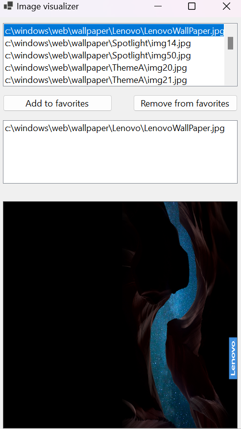
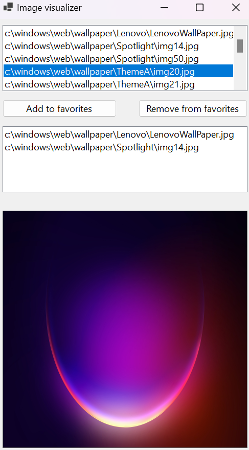

# IMG-Viewer

## Descrição

IMG-Viewer é um visualizador de imagem simples desenvolvido em C# no windows.

## Funcionalidades 

- **Suporte a múltiplos formatos de imagem**: Compatível com formatos como JPEG, PNG, BMP, entre outros.
- **Navegação fácil**: Permite navegar entre imagens em uma pasta específica.
- **Interface simples**: Design simples feito utilizando windows forms do Visual Studio 2022 como base. 

## Capturas de tela






*É possível adicionar e remover dos favoritos*

## Requisitos do Sistema

- **Sistema Operacional**: Windows 7 ou superior
- **.NET Framework**: Versão 4.7.2 ou superior

## Instalação

1. Clone este repositório:
   ```bash
   git clone https://github.com/SupaNiac/IMG-Viewer.git

## Possíveis mudanças: 

- 📁 Permitir que o usuário selecione qualquer pasta do sistema para carregar imagens.

- 🎥 Suporte à adição e visualização de vídeos.

- 🎞️ Suporte à adição e visualização de GIFs animados.

- 🎨 Melhorar a interface gráfica para uma aparência mais moderna e agradável.

  

